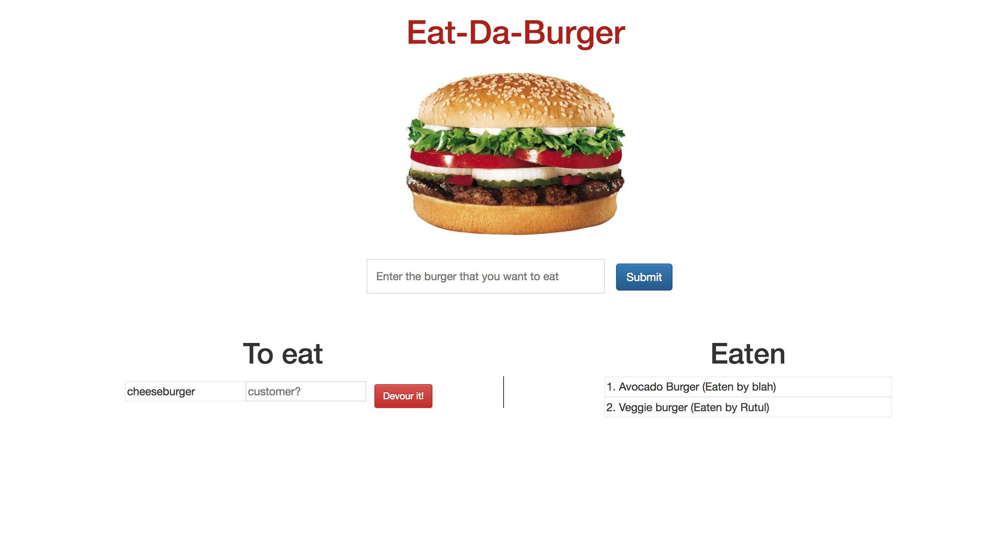

# HW-sequelizedBurger
HW - Eat the Burger (sequelized version), is a node, express, sequelize &amp; mysql coding HW application.

# Description
A burger application that is made using technologies listed below which allows user to add burger order with their name & update their status in the database using Sequelize.

# Live App URL
https://burgerapp-sequelized.herokuapp.com/?burger-name=Veggie+burger

## Technologies used
 - nodejs
 - expressjs
 - Sequelize
 - npm packages
 - HTML, CSS, JS
 - jQuery
 - MySQL

# App screenshot
 